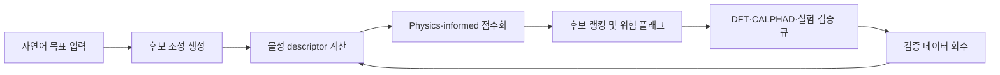
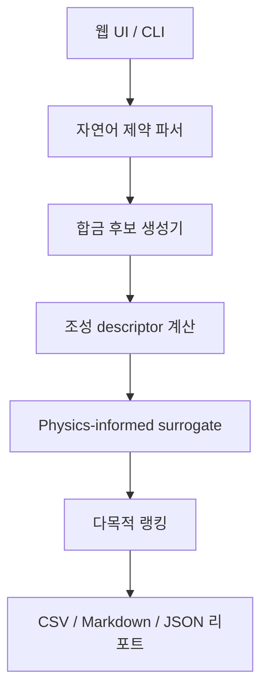
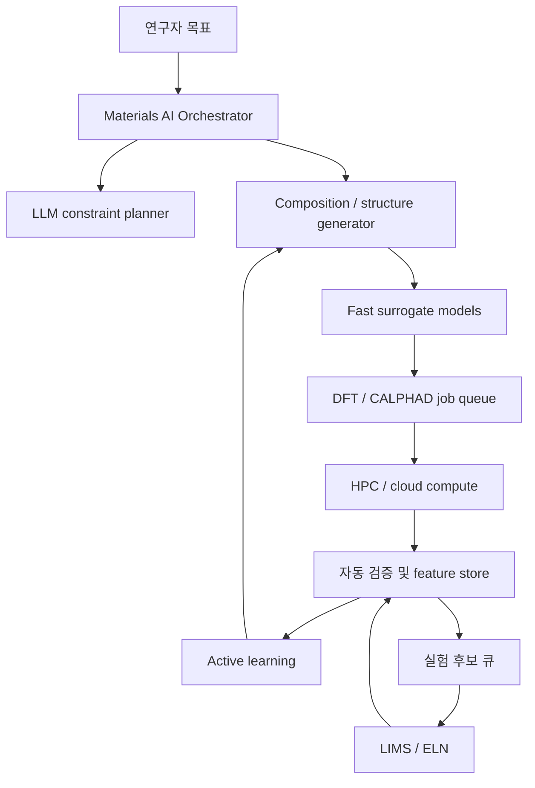

# 핵융합로용 차세대 소재 발견 AI 시스템 설계

## 1. 목표

목표는 핵융합로 내부의 극한 열, 방사선, 기계적 응력 환경을 견딜 수 있는 차세대 내화 합금 후보를 빠르게 탐색하는 AI 시스템을 구축하는 것이다. 특히 텅스텐 기반 또는 Nb-Ta 기반 다원계 합금에서 고온 강도와 연성을 동시에 만족할 가능성이 높은 후보를 먼저 찾고, 계산과 실험으로 검증할 우선순위를 제시한다.

이 시스템은 “AI가 최종 소재를 발견했다”고 선언하는 구조가 아니다. 후보 조성 공간을 줄이고, 연구자가 DFT, CALPHAD, 합성, 인장시험, 조사 손상 평가에 자원을 집중할 수 있게 만드는 의사결정 보조 시스템이다.

## 2. DuctGPT 방식에서 가져온 핵심 구조

DuctGPT 관련 공식 자료와 논문 초록에서 확인되는 구조는 다음과 같다.

1. AtomGPT 계열의 생성형/예측형 모델을 재료 과학 데이터에 맞게 조정한다.
2. 내화 다원계 합금의 조성과 구조 설명을 입력으로 사용한다.
3. 연성, 전자구조, 탄성상수, VEC 등 물리 기반 descriptor를 함께 쓴다.
4. 넓은 조성 공간을 빠르게 screening한다.
5. 불확실성과 실험 검증을 통해 모델 예측을 닫힌 루프로 개선한다.

본 프로토타입은 위 구조를 경량화해 다음 네 단계로 구현했다.

## 3. MVP 아키텍처

### 3.1 자연어 제약 파서

현재 파서는 다음 표현을 해석한다.

1. `W-rich`, `텅스텐 기반`, `텅스텐 고함량`
2. `NbTa-rich`, `Nb-Ta`
3. `low activation`, `저방사화`
4. `ductile`, `ductility`, `연성`
5. `density < 15`, `밀도 15 이하`
6. 원소 기호 또는 한국어 원소명

장기적으로는 이 부분을 LLM tool-calling agent로 바꿔 연구자의 자연어 목표를 구조화된 탐색 조건으로 변환한다.

### 3.2 후보 생성기

현재 후보 생성기는 W, Ta, Nb, Ti, V, Mo, Hf, Zr 중심의 내화 합금 공간에서 3~5원계 조성을 생성한다. DuctGPT 논문에 언급된 W-Ti-Zr-Hf, W-Ti-V, NbTa-Ti-V 계열을 seed family로 포함했다.

생성기는 다음 제약을 확인한다.

1. 필수 원소 포함 여부
2. W 또는 NbTa 최소 함량
3. 평균 융점 하한
4. 밀도 상한
5. 허용 원소군

### 3.3 Descriptor

현재 계산하는 descriptor는 다음과 같다.

| Descriptor | 목적 |
| --- | --- |
| 평균 융점 | 고온 구조 안정성 proxy |
| 평균 밀도 | 구조 부품 중량 부담 proxy |
| VEC | BCC 안정성 proxy |
| 혼합 엔트로피 | 다원계 고용체 안정화 proxy |
| 원자 크기 불일치 | 단상 형성 및 취성 위험 proxy |
| 전기음성도 분산 | 화학적 복잡도 proxy |
| 내화 원소 비율 | 고온 적용 가능성 proxy |

### 3.4 점수화 모델

현재 모델은 학습된 모델이 아니라 휴리스틱 surrogate다. 점수는 다음 항목으로 구성된다.

1. 연성 점수
2. 고온 적합성 점수
3. BCC 안정성 점수
4. 저방사화 가능성 점수
5. 합성 가능성 점수
6. 제조 가능성 점수
7. 불확실성 점수

이 구조는 이후 실제 데이터가 들어오면 XGBoost, Gaussian Process, GNN, AtomGPT/LLM 기반 모델로 교체할 수 있다.

## 4. 생산용 시스템 확장안

생산용에서는 다음 컴포넌트가 필요하다.

1. 소재 데이터베이스: 조성, 공정, 열처리, 미세조직, 시험 조건, 원자료를 저장한다.
2. Feature store: DFT, CALPHAD, 실험 descriptor를 일관된 스키마로 관리한다.
3. 모델 레지스트리: surrogate 모델 버전, 학습 데이터 범위, 검증 성능을 기록한다.
4. 계산 큐: VASP, Quantum ESPRESSO, LAMMPS, Thermo-Calc, pycalphad 등 외부 계산을 실행한다.
5. 실험 큐: 합성, XRD, SEM-EDS, EBSD, 인장, 경도, 열피로, 조사 손상 시험을 관리한다.
6. Active learning: 불확실성이 크면서 기대 성능이 높은 후보를 다음 실험으로 추천한다.

## 5. 최소 데이터 스키마

### AlloyCandidate

| 필드 | 설명 |
| --- | --- |
| candidate_id | 후보 ID |
| composition_at_percent | 원소별 at.% |
| processing_route | 아크멜팅, 분말야금, AM 등 공정 |
| heat_treatment | 열처리 조건 |
| target_application | PFC, blanket, divertor 등 적용 부위 |
| generated_by | 모델/규칙 버전 |
| status | generated, dft_queued, synthesized, tested, rejected |

### ComputedProperties

| 필드 | 설명 |
| --- | --- |
| formation_energy | 형성에너지 |
| elastic_constants | 탄성상수 |
| pugh_ratio | 연성 proxy |
| cauchy_pressure | 연성 proxy |
| dos_fermi | Fermi level DOS |
| bcc_phase_probability | 단상 BCC 가능성 |
| defect_energy | 결함/전위 관련 proxy |

### ExperimentalResults

| 필드 | 설명 |
| --- | --- |
| phase_xrd | XRD 상분석 |
| microstructure | SEM/EBSD 미세조직 |
| yield_strength | 항복강도 |
| ultimate_tensile_strength | 인장강도 |
| elongation_percent | 연신율 |
| hardness | 경도 |
| irradiation_condition | 조사 조건 |
| swelling_percent | swelling 결과 |
| hydrogen_retention | 수소 보유 |

## 6. 검증 게이트

후보 합금은 다음 게이트를 통과해야 다음 단계로 이동한다.

1. 계산 게이트: BCC 안정성, 형성에너지, 탄성상수, 연성 proxy가 기준 이상인지 확인한다.
2. 합성 게이트: 소량 합성 가능성, 균일 조성, 주요 2차상 발생 여부를 확인한다.
3. 기계적 성능 게이트: 상온/고온 연신율과 강도를 확인한다.
4. 핵융합 환경 게이트: 조사 손상, He/H 보유, swelling, 열피로를 평가한다.
5. 제조 게이트: 성형성, 접합성, 가공성, 원소 비용과 공급망을 검토한다.

## 7. 현재 프로토타입의 한계

현재 구현은 실제 DuctGPT가 아니다. 공개 원소 물성과 휴리스틱만으로 만든 로컬 screening 도구다. 따라서 점수는 연구 우선순위 결정용 참고값이며, 실제 소재 성능을 보증하지 않는다.

정확도를 높이려면 다음 데이터가 필요하다.

1. 내화 MPEA 실험 연신율 데이터
2. DFT 기반 탄성상수와 전자구조 데이터
3. BCC/FCC/2차상 상 안정성 데이터
4. 중성자 조사 후 swelling, hardening, embrittlement 데이터
5. 수소/헬륨 보유와 플라즈마 침식 데이터

## 8. 참고 자료

1. Ames National Laboratory, “DuctGPT demonstrates how AI can accelerate discovery of next-generation fusion materials”: https://www.ameslab.gov/news/ductgpt-demonstrates-how-ai-can-accelerate-discovery-of-next-generation-fusion-materials
2. Sai Pranav Reddy Guduru et al., “DuctGPT: A Generative Transformer for Forward Screening of Ductile Refractory Multi-Principal Element Alloys,” Acta Materialia, 2026: https://doi.org/10.1016/j.actamat.2025.121763
3. NIST, “AtomGPT: Atomistic Generative Pre-trained Transformer for Forward and Inverse Materials Design”: https://www.nist.gov/publications/atomgpt-atomistic-generative-pre-trained-transformer-forward-and-inverse-materials
